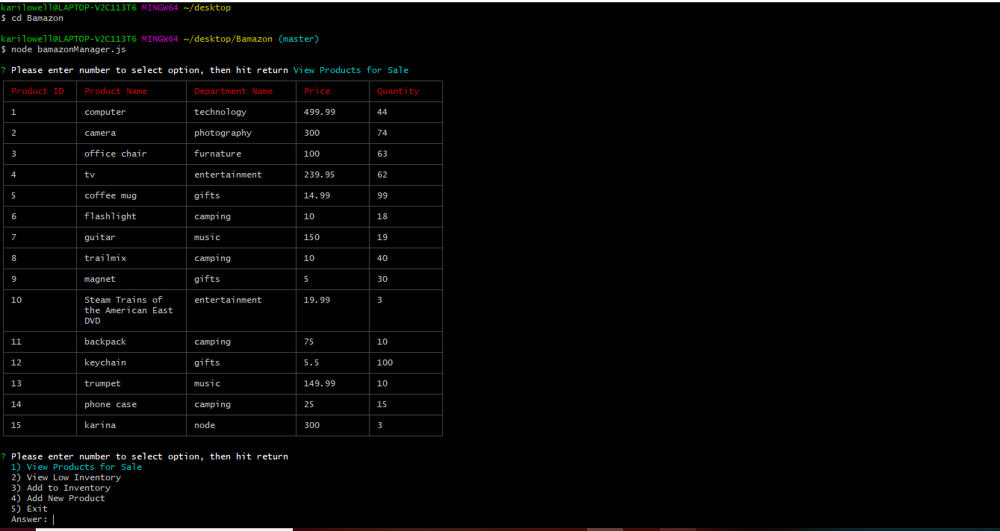

# Bamazon
This is an inventory management command line application that has two interfaces, one for the store manager to controll inventory, and another for a customer to make a purchase. Bamazon utilized the npm Inquirer package as well as MySQL.
 
 
 
 
 
